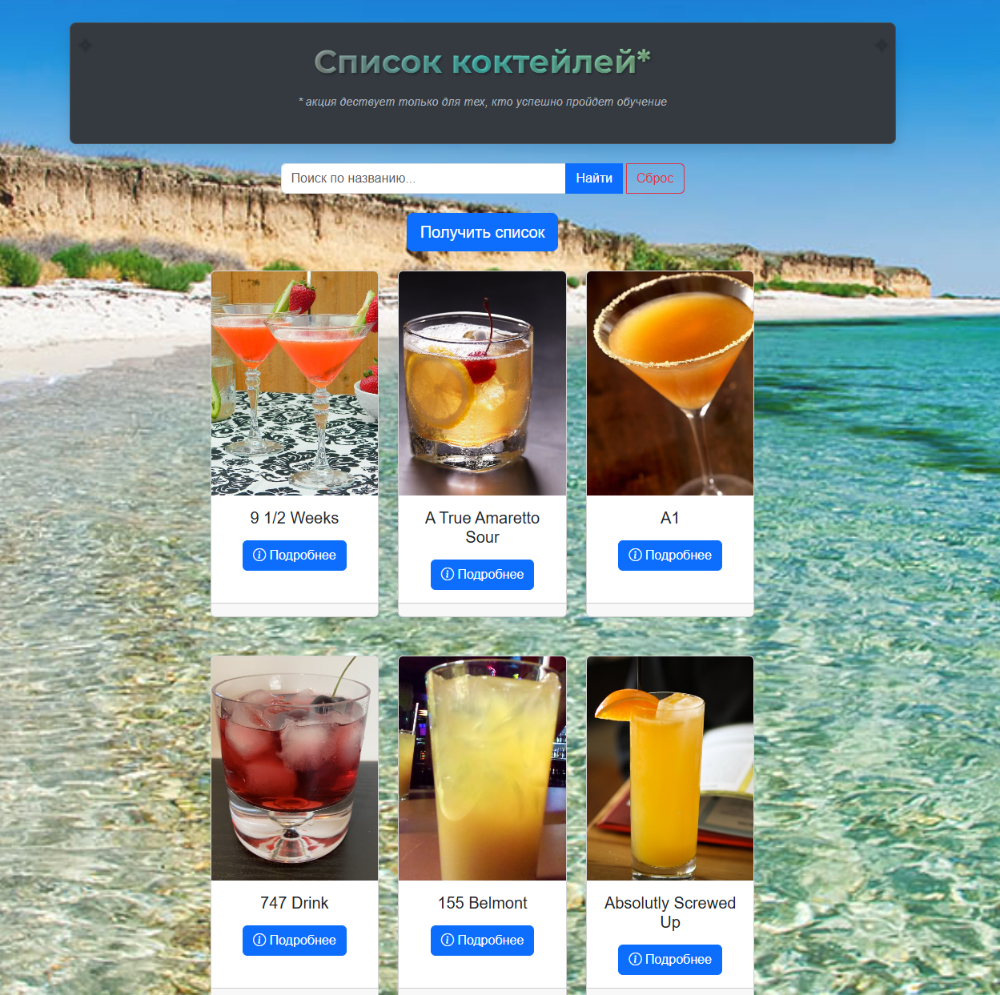
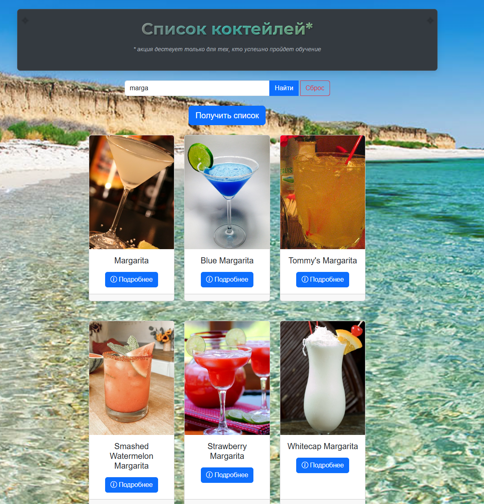

# Cocktail Finder App
 

## Приложение для поиска коктейлей с использованием TheCocktailDB API.
## Иногда требуется вкл VPN

## 📌 Общий поток работы

### 1. Инициализация приложения
- Загрузка DOM структуры
- Получение ссылок на элементы интерфейса:
  - Кнопка "Получить список"
  - Поле поиска и кнопки "Найти"/"Сброс"
  - Контейнер для карточек коктейлей
  - Спиннер загрузки
- Навешивание обработчиков событий

### 2. Основные сценарии работы

#### 🔹 Загрузка популярных коктейлей

sequenceDiagram
    Пользователь->>Приложение: Нажимает "Получить список"
    Приложение->>API: GET /filter.php?c=Cocktail
    API-->>Приложение: Список коктейлей (первые 12)
    loop Для каждого коктейля
        Приложение->>API: GET /lookup.php?i={idDrink}
        API-->>Приложение: Детальная информация
    end
    Приложение->>DOM: Создание карточек

### 🔹 Поиск коктейлей
    graph TD
    A[Пользователь вводит название] --> B{Нажимает Enter/Кнопку}
    B --> C[Отправка запроса к API]
    C --> D[Отображение результатов]
    D --> E{Результаты есть?}
    E -->|Да| F[Показ карточек]
    E -->|Нет| G[Показ сообщения "Не найдено"]

    🔹 Просмотр деталей коктейля
Клик на кнопку "Подробнее" в карточке

Открытие модального окна с:

Изображением

Списком ингредиентов

Инструкцией приготовления

Закрытие по клику вне окна

### 3. Особенности реализации

#### Поиск:

-- Работает по нажатию Enter/кнопки "Найти"

-- Кнопка "Сброс" возвращает стандартный список

Визуальная обратная связь при действиях

Модальные окна:

Динамическое создание/удаление

Контроль состояния прокрутки страницы

Защита от "утечек" памяти

Обработка ошибок:

Сообщения при неудачных запросах

Автоматическое восстановление прокрутки

Блокировка интерфейса на время загрузки

Технические детали
API Endpoints
Метод	Описание
filter.php	Получение списка коктейлей
search.php	Поиск по названию
lookup.php	Получение деталей по ID

Общий поток работы
Пользователь кликает "Получить список" → loadCocktails().

Загружается список коктейлей → для каждого вызывается fetchCocktailDetails().

Для каждого коктейля создается карточка → createCocktailCard().

При клике на "Подробнее" → showCocktailDetails().

При закрытии модального окна → resetBodyScroll() восстанавливает прокрутку.

#### Как это работает:

Пользователь вводит название коктейля в поле поиска

При нажатии "Найти" или Enter выполняется запрос к API с параметром поиска

Отображаются только коктейли, соответствующие запросу

Кнопка "Сброс" возвращает стандартный список коктейлей